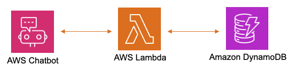
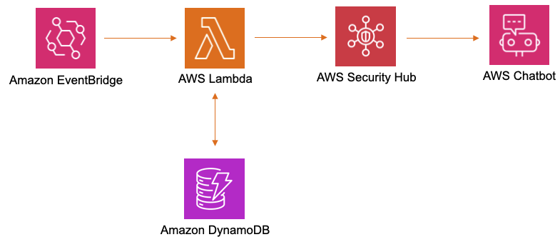

# lunkerzero

Lunker Zero, a.k.a. LZ, performs Threat Surface monitoring with ChatOps to detect Internet-accessible network risk and Open Source Intelligence reputation.

The application has three environments for developing new detections that can be promoted once ready.

 - Development
 - Guinea Pigs
 - Production

Threat Surface monitoring results get separated by deploying new **code names** for each Amazon Web Services (AWS) cloud investigation.

 - Walleye
 - Perch
 - Northern

Slack notifications are received when a monitored DNS, IPv4, or IPv6 is added/removed from checked OSINT threat feeds.

Censys Search also provides Slack notifications when ports are opened/closed from the Autonomous System (AS) number query results.

https://search.censys.io

Lastly, the Webrecorder project archives websites for inspection using Amazon GuardDuty & Macie for malicious and sensitive content detection.

https://github.com/webrecorder

## AWS Chatbot for Slack



### Add Artifact

```
@aws invoke walleye --payload {"add”: “4n6ir.com”}
```

```
@aws invoke walleye --payload {"add”: “127.0.0.1”}
```

```
@aws invoke walleye --payload {"add”: “::1”}
```

### List Artifacts

```
@aws invoke walleye --payload {"list”: “all”}
```

```
@aws invoke walleye --payload {"list”: “dns”}
```

```
@aws invoke walleye --payload {"list”: “ipv4”}
```

```
@aws invoke walleye --payload {"list”: “ipv6”}
```

### Remove Artifact

```
@aws invoke walleye --payload {"remove”: “4n6ir.com”}
```

```
@aws invoke walleye --payload {"remove”: “127.0.0.1”}
```

```
@aws invoke walleye --payload {"remove”: “::1”}
```

### Delete Artifacts

```
@aws invoke walleye --payload {"delete”: “all”}
```

```
@aws invoke walleye --payload {"delete”: “dns”}
```

```
@aws invoke walleye --payload {"delete”: “ipv4”}
```

```
@aws invoke walleye --payload {"delete”: “ipv6”}
```

### Autonomous System

```
@aws invoke walleye --payload {"as”:”AS65535”}
```

```
@aws invoke walleye --payload {"handle”:”FAKE-1”}
```

```
@aws invoke walleye --payload {"list”: “as”}
```

```
@aws invoke walleye --payload {"delete”: “as”}
```

### Classless Inter-Domain Routing

```
@aws invoke walleye --payload {"cidr”:”127.0.0.1/24”}
```

```
@aws invoke walleye --payload {"list”: “cidr”}
```

```
@aws invoke walleye --payload {"delete”: “cidr”}
```

## Amazon EventBridge Rules



### Censys Search

```
{"censys”: “search”}
```

### Open Source Intelligence

```
{"osint”: “dns”}
```

```
{"osint”: “ipv4”}
```

```
{"osint”: “ipv6”}
```

## Amazon GuardDuty & Macie


### Website Inspection

```
@aws invoke walleye --payload {"inspect”: “https://4n6ir.com”}
```
